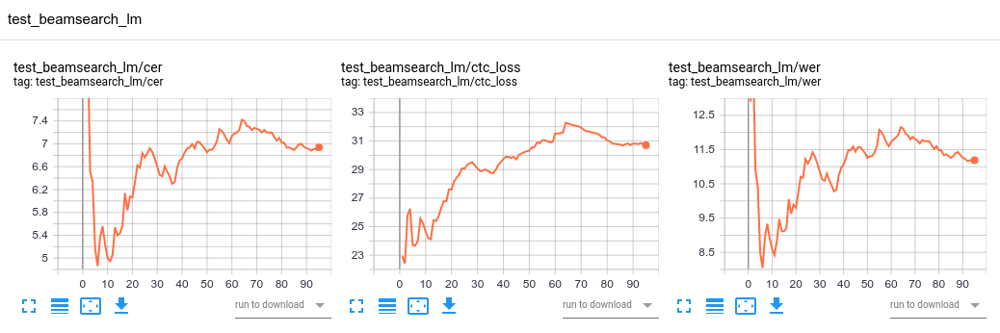

# Vietnamese (Or other languages) Automatic Speech Recognition and SEGAN

VASR and SEGAN Implementation in Tensorflow Keras.

## !Important

This code is NOT applied for distributed training YET.

## Dataset for Vietnamese

Collected from many sources:

1. VIVOS: 15hrs from [ailab.hcmus.edu.vn/vivos](https://ailab.hcmus.edu.vn/vivos)
2. InfoRe: 25hrs Single Person + ~415hrs from [facebook](https://www.facebook.com/groups/j2team.community/permalink/1010834009248719/)
3. VLSP: ~415hrs (the same as InfoRe 415hrs)

## Results

### Features, Model and Decoder

* Features: 80 ```Log mel spectrogram```, ```Delta``` and ```Delta_delta```
* Model: Based Deep Speech 2
    * 3 Conv with kernels ```[11, 41], [11, 21], [11, 11]```, strides ```[2,2], [1, 2], [1, 2]``` and filters ```32, 32, 96```
    * 5 BLSTM with ```1024``` units total
    * 1 FC Softmax
* Decoder: BeamSearch with 5-gram KenLM, beam width ```500```, alpha ```2.0``` and beta ```1.0```

### Test results

1. Train set: VIVOS train | Test set: VIVOS test | No augmentations | Results: ```WER = 11.1888%, CER = 6.9391%```

    

3. Train set: VIVOS train, 80% VLSP, Private dataset | Test set: VIVOS test, InfoRe 25hrs, 20% VLSP | White noise, real world noises, time stretch, freq masking, time masking | Results: ```WER = %, CER = %```

    


## Requirements

1. Ubuntu or Debian distribution
2. Python 3.6+
3. Tensorflow 2.2+: ```pip install tensorflow```

## Featurizers

### Speech Features

**Speech features** are extracted from the **Signal** with ```sample_rate```, ```frame_ms```, ```stride_ms``` and ```num_feature_bins```.

Speech features has the shape ```(batch, time, num_feature_bins, channels)``` and it contains from 1-4 channels:

1. Spectrogram, Log Mel Spectrogram (log filter banks) or MFCCs
2. Delta features: ```librosa.feature.delta``` from the features extracted on channel 1.
3. Delta deltas features: ```librosa.feature.delta``` with ```order=2``` from the features extracted on channel 1.
4. Pitch features: ```librosa.core.piptrack``` from the signal

### Text Features

**Text features** are read as index from the file ```data/vocabulary.txt``` plus 1 at the end for the blank index. You can extend the characters to match with your language in this file.

## Models

There're 3 main models in this repo: CTCModel, SEGAN and RNNTransducer

**CTCModel** uses DeepSpeech2 as the base model. You can write your custom model instead of DeepSpeech2, make sure that the input matches the speech features and output is in the shape ```(batch, time, num_classes)```.

**SEGAN** was created exactly as the segan repo in the references and tested.

**RNNTransducer** is under development.

## Training

Train using ```tf.GradientTape``` with ```tf.data.Dataset.from_generator``` or ```tf.data.TFRecordDataset```.

## Evaluation Metrics

* STT: *Word Error Rate (WER)* and *Character Error Rate (CER)* are used.
* SEGAN: [https://github.com/usimarit/semetrics](https://github.com/usimarit/semetrics)

## Running

Default config files can be found in directory ```configs```. Make sure your custom config has the same structure.

```bash
chmod a+x setup.sh && chown $USER:$USER setup.sh && ./setup.sh # Install dependencies
python run.py --help # --help to see the flags
```

## References & Credits

1. [https://arxiv.org/abs/1512.02595](https://arxiv.org/abs/1512.02595)
2. [https://github.com/NVIDIA/OpenSeq2Seq](https://github.com/NVIDIA/OpenSeq2Seq)
3. [https://github.com/santi-pdp/segan](https://github.com/santi-pdp/segan)
