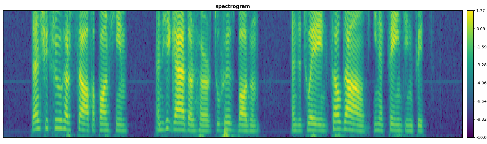
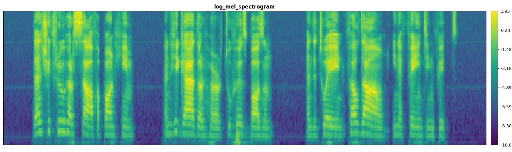
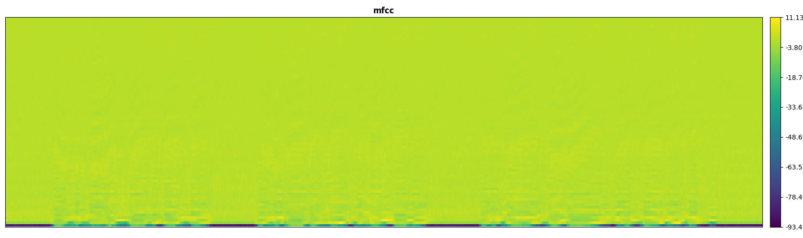
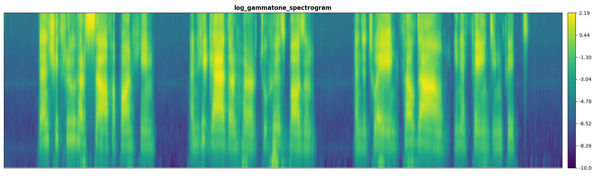

# Speech Features Extraction

See [feature_extraction.py](../tensorflow_asr/models/layers/feature_extraction.py) for more detail

**Speech features** are extracted from the **Signal** with `sample_rate`, `frame_ms`, `stride_ms` and `num_feature_bins`.

Speech features has the shape `(B, T, num_feature_bins, num_channels)` and it contains from 1-4 channels:

1. Spectrogram, Log Mel Spectrogram, Log Gammatone Spectrogram or MFCCs
2. TODO: Delta features: like `librosa.feature.delta` from the features extracted on channel 1.
3. TODO: Delta deltas features: like `librosa.feature.delta` with `order=2` from the features extracted on channel 1.
4. TODO: Pitch features: like `librosa.core.piptrack` from the signal

Implementation in tensorflow keras [layer](../tensorflow_asr/models/layers/feature_extraction.py)

