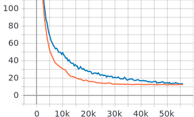

# Conformer: Convolution-augmented Transformer for Speech Recognition

Reference: [https://arxiv.org/abs/2005.08100](https://arxiv.org/abs/2005.08100)


## Example Model YAML Config

```yaml
speech_config:
    sample_rate: 16000
    frame_ms: 25
    stride_ms: 10
    num_feature_bins: 80
    feature_type: logfbank
    preemphasis: 0.97
    normalize_signal: True
    normalize_feature: True
    normalize_per_feature: False

model_config:
    name: conformer
    dmodel: 144
    reduction_factor: 4
    num_blocks: 16
    head_size: 36
    num_heads: 4
    kernel_size: 32
    fc_factor: 0.5
    dropout: 0.1
    embed_dim: 144
    embed_dropout: 0.0
    num_lstms: 1
    lstm_units: 320
    joint_dim: 1024

learning_config:
    augmentations:
        after:
            time_masking:
                num_masks: 10
                mask_factor: 100
                p_upperbound: 0.2
            freq_masking:
                num_masks: 1
                mask_factor: 27

    dataset_config:
        train_paths: null
        eval_paths: null
        test_paths: null
        tfrecords_dir: /mnt/Data/ML/ASR/Preprocessed/Vivos/TFRecords

    optimizer_config:
        warmup_steps: 10000
        beta1: 0.9
        beta2: 0.98
        epsilon: 1e-9

    running_config:
        batch_size: 4
        num_epochs: 21
        outdir: /mnt/Projects/asrk16/trained/vivos/conformer
        log_interval_steps: 400
        save_interval_steps: 400
        eval_interval_steps: 1000
```

## Usage

Training, see `python examples/conformer/train_conformer.py --help`

Testing, see `python examples/conformer/train_conformer.py --help`

## Results on Vietnamese Vivos Corpus

Vivos Conformer is trained with above config in 10 hours.

**Transducer Loss**



**Error Rates**

|          |  WER (%)   |  CER (%)   |
| :------- | :--------: | :--------: |
| _Greedy_ | 42.7813034 | 22.1981564 |
