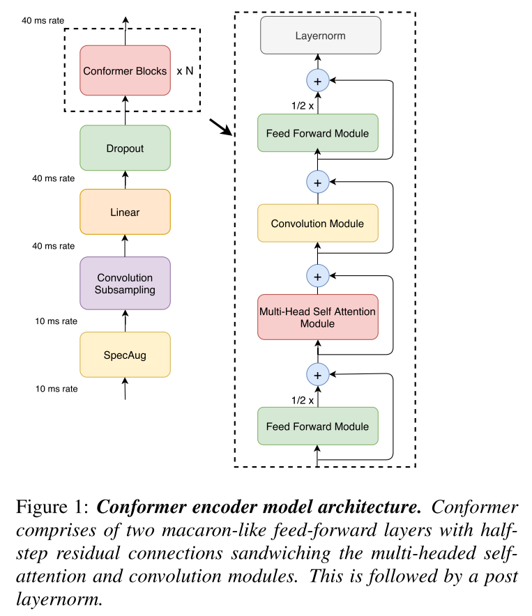

# Conformer: Convolution-augmented Transformer for Speech Recognition

Reference: [https://arxiv.org/abs/2005.08100](https://arxiv.org/abs/2005.08100)



## Example Model YAML Config

```yaml
speech_config:
  sample_rate: 16000
  frame_ms: 25
  stride_ms: 10
  feature_type: log_mel_spectrogram
  num_feature_bins: 80
  preemphasis: 0.97
  normalize_signal: True
  normalize_feature: True
  normalize_per_feature: False

decoder_config:
  vocabulary: null
  target_vocab_size: 1024
  max_subword_length: 4
  blank_at_zero: True
  beam_width: 5
  norm_score: True

model_config:
  name: conformer
  subsampling:
    type: conv2
    kernel_size: 3
    strides: 2
    filters: 144
  positional_encoding: sinusoid_concat
  dmodel: 144
  num_blocks: 16
  head_size: 36
  num_heads: 4
  mha_type: relmha
  kernel_size: 32
  fc_factor: 0.5
  dropout: 0.1
  embed_dim: 320
  embed_dropout: 0.0
  num_rnns: 1
  rnn_units: 320
  rnn_type: lstm
  layer_norm: True
  joint_dim: 320

learning_config:
  augmentations:
    after:
      time_masking:
        num_masks: 10
        mask_factor: 100
        p_upperbound: 0.2
      freq_masking:
        num_masks: 1
        mask_factor: 27

  dataset_config:
    train_paths: ...
    eval_paths: ...
    test_paths: ...
    tfrecords_dir: ...

  optimizer_config:
    warmup_steps: 10000
    beta1: 0.9
    beta2: 0.98
    epsilon: 1e-9

  running_config:
    batch_size: 4
    num_epochs: 22
    outdir: ...
    log_interval_steps: 400
    save_interval_steps: 400
    eval_interval_steps: 1000
```

## Usage

Training, see `python examples/conformer/train_*.py --help`

Testing, see `python examples/conformer/test_*.py --help`

TFLite Conversion, see `python examples/conformer/tflite_*.py --help`

## Conformer Subwords - Results on LibriSpeech

**Summary**

- Number of subwords: 1031
- Maxium length of a subword: 4
- Subwords corpus: all training sets, dev sets and test-clean
- Number of parameters: 10,341,639
- Positional Encoding Type: sinusoid concatenation

**Pretrained and Config**, go to [drive](https://drive.google.com/drive/folders/1VAihgSB5vGXwIVTl3hkUk95joxY1YbfW?usp=sharing)

**Transducer Loss**


**Error Rates**

| **Test-clean** |  WER (%)  |  CER (%)   |
| :------------: | :-------: | :--------: |
|    _Greedy_    | 6.4476862 | 2.51828337 |

| **Test-other** |  WER (%)   |  CER (%)   |
| :------------: | :--------: | :--------: |
|    _Greedy_    | 15.7308521 | 7.67273521 |
