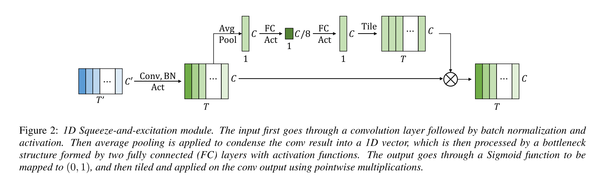

# ContextNet: Improving Convolutional Neural Networks for Automatic Speech Recognition with Global Context

Reference: [http://arxiv.org/abs/2005.03191](http://arxiv.org/abs/2005.03191)




## Example Model YAML Config

```yaml
speech_config:
  sample_rate: 16000
  frame_ms: 25
  stride_ms: 10
  feature_type: log_mel_spectrogram
  num_feature_bins: 80
  preemphasis: 0.97
  normalize_signal: True
  normalize_feature: True
  normalize_per_feature: False

decoder_config:
  vocabulary: null
  target_vocab_size: 1024
  max_subword_length: 4
  blank_at_zero: True
  beam_width: 5
  norm_score: True

model_config:
  name: contextnet
  encoder_alpha: 0.5
  encoder_blocks:
    # C0
    - nlayers: 1
      kernel_size: 5
      filters: 256
      strides: 1
      residual: False
      activation: silu
    # C1-C2
    - nlayers: 5
      kernel_size: 5
      filters: 256
      strides: 1
      residual: True
      activation: silu
    - nlayers: 5
      kernel_size: 5
      filters: 256
      strides: 1
      residual: True
      activation: silu
    # C3
    - nlayers: 5
      kernel_size: 5
      filters: 256
      strides: 2
      residual: True
      activation: silu
    # C4-C6
    - nlayers: 5
      kernel_size: 5
      filters: 256
      strides: 1
      residual: True
      activation: silu
    - nlayers: 5
      kernel_size: 5
      filters: 256
      strides: 1
      residual: True
      activation: silu
    - nlayers: 5
      kernel_size: 5
      filters: 256
      strides: 1
      residual: True
      activation: silu
    # C7
    - nlayers: 5
      kernel_size: 5
      filters: 256
      strides: 2
      residual: True
      activation: silu
    # C8 - C10
    - nlayers: 5
      kernel_size: 5
      filters: 256
      strides: 1
      residual: True
      activation: silu
    - nlayers: 5
      kernel_size: 5
      filters: 256
      strides: 1
      residual: True
      activation: silu
    - nlayers: 5
      kernel_size: 5
      filters: 256
      strides: 1
      residual: True
      activation: silu
    # C11 - C13
    - nlayers: 5
      kernel_size: 5
      filters: 512
      strides: 1
      residual: True
      activation: silu
    - nlayers: 5
      kernel_size: 5
      filters: 512
      strides: 1
      residual: True
      activation: silu
    - nlayers: 5
      kernel_size: 5
      filters: 512
      strides: 1
      residual: True
      activation: silu
    # C14
    - nlayers: 5
      kernel_size: 5
      filters: 512
      strides: 2
      residual: True
      activation: silu
    # C15 - C21
    - nlayers: 5
      kernel_size: 5
      filters: 512
      strides: 1
      residual: True
      activation: silu
    - nlayers: 5
      kernel_size: 5
      filters: 512
      strides: 1
      residual: True
      activation: silu
    - nlayers: 5
      kernel_size: 5
      filters: 512
      strides: 1
      residual: True
      activation: silu
    - nlayers: 5
      kernel_size: 5
      filters: 512
      strides: 1
      residual: True
      activation: silu
    - nlayers: 5
      kernel_size: 5
      filters: 512
      strides: 1
      residual: True
      activation: silu
    - nlayers: 5
      kernel_size: 5
      filters: 512
      strides: 1
      residual: True
      activation: silu
    - nlayers: 5
      kernel_size: 5
      filters: 512
      strides: 1
      residual: True
      activation: silu
    # C22
    - nlayers: 1
      kernel_size: 5
      filters: 640
      strides: 1
      residual: False
      activation: silu
  prediction_embed_dim: 640
  prediction_embed_dropout: 0
  prediction_num_rnns: 1
  prediction_rnn_units: 640
  prediction_rnn_type: lstm
  prediction_rnn_implementation: 1
  prediction_layer_norm: True
  prediction_projection_units: 0
  joint_dim: 640

learning_config:
  augmentations:
    after:
      time_masking:
        num_masks: 10
        mask_factor: 100
        p_upperbound: 0.2
      freq_masking:
        num_masks: 1
        mask_factor: 27

  dataset_config:
    train_paths: ...
    eval_paths: ...
    test_paths: ...
    tfrecords_dir: ...

  optimizer_config:
    warmup_steps: 10000
    beta1: 0.9
    beta2: 0.98
    epsilon: 1e-9

  running_config:
    batch_size: 4
    num_epochs: 22
    outdir: ...
    log_interval_steps: 400
    save_interval_steps: 400
    eval_interval_steps: 1000
```

## Usage

Training, see `python examples/contextnet/train_*.py --help`

Testing, see `python examples/contextnet/test_*.py --help`

TFLite Conversion, see `python examples/contextnet/tflite_*.py --help`
