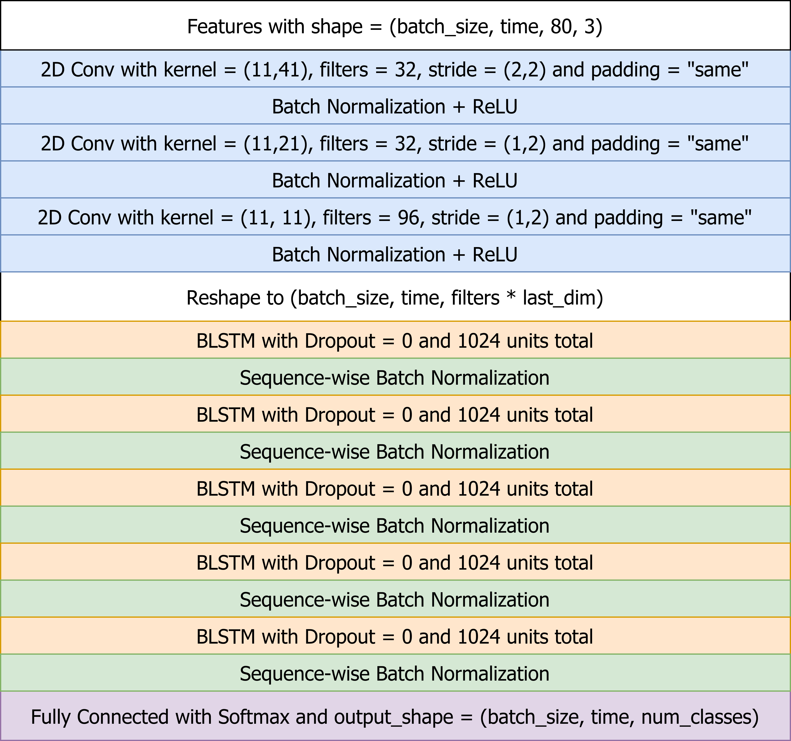

# Deep Speech 2

References: [https://arxiv.org/abs/1512.02595](https://arxiv.org/abs/1512.02595)

## Model YAML Config Structure

```yaml
model_config:
  conv_type: conv2d
  conv_kernels: [[11, 41], [11, 21], [11, 11]]
  conv_strides: [[2, 2], [1, 2], [1, 2]]
  conv_filters: [32, 32, 96]
  conv_dropout: 0.1
  rnn_nlayers: 5
  rnn_type: lstm
  rnn_units: 512
  rnn_bidirectional: True
  rnn_rowconv: 0
  rnn_dropout: 0.1
  fc_nlayers: 0
  fc_units: 1024
```

## Architecture



## Training and Testing

See `python examples/deepspeech2/train_ds2.py --help`

See `python examples/deepspeech2/test_ds2.py --help`