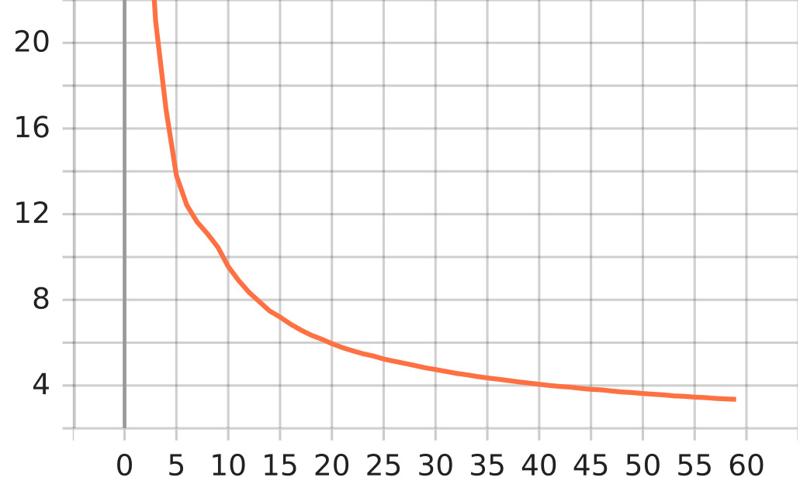
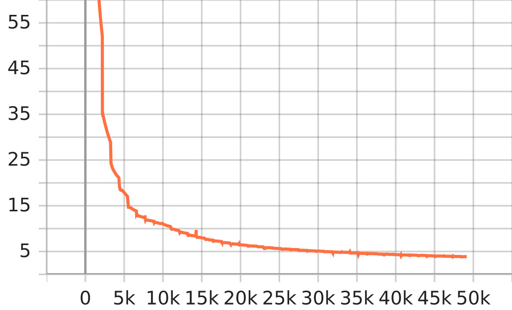

- [\[English\] LibriSpeech](#english-librispeech)
  - [I. Small + SentencePiece 256](#i-small--sentencepiece-256)
  - [II. Small + Streaming + SentencePiece 256](#ii-small--streaming--sentencepiece-256)

# [English] LibriSpeech

## I. Small + SentencePiece 256

| Category          | Description                                                                              |
| :---------------- | :--------------------------------------------------------------------------------------- |
| Config            | [small.yml.j2](../../small.yml.j2)                                                       |
| Tensorflow        | **2.18.0**                                                                               |
| Device            | Google Cloud TPUs v4-8                                                                   |
| Mixed Precision   | strict                                                                                   |
| Global Batch Size | 8 * 4 * 8 = 256 (as 4 TPUs, 8 Gradient Accumulation Steps)                               |
| Max Epochs        | 450                                                                                      |
| Pretrained        | [Link](https://www.kaggle.com/models/lordh9072/tfasr-conformer-ctc/tensorFlow2/v3-small) |

**Config:**

```jinja2

{{decoder_config}}

{{config}}
```

**Results:**

| Epoch | Dataset    | decoding | wer       | cer       | mer       | wil      | wip      |
| :---- | :--------- | :------- | :-------- | :-------- | :-------- | :------- | :------- |
| 170   | test-clean | greedy   | 0.0967171 | 0.031954  | 0.0958403 | 0.168307 | 0.831693 |
| 170   | test-other | greedy   | 0.201612  | 0.0812955 | 0.197415  | 0.330207 | 0.669793 |


## II. Small + Streaming + SentencePiece 256

| Category          | Description                                                                                        |
| :---------------- | :------------------------------------------------------------------------------------------------- |
| Config            | [small-streaming.yml.j2](../../small-streaming.yml.j2)                                             |
| Tensorflow        | **2.18.0**                                                                                         |
| Device            | Google Cloud TPUs v4-8                                                                             |
| Mixed Precision   | strict                                                                                             |
| Global Batch Size | 8 * 4 * 8 = 256 (as 4 TPUs, 8 Gradient Accumulation Steps)                                         |
| Max Epochs        | 450                                                                                                |
| Pretrained        | [Link](https://www.kaggle.com/models/lordh9072/tfasr-conformer-ctc/tensorFlow2/v3-small-streaming) |

**Config:**

```jinja2

{{decoder_config}}

{{config}}
```

**Tensorboard:**

<table>
  <tr>
    <td align="center">
      <br>
      <sub><strong>Epoch Loss</strong></sub>
    </td>
    <td align="center">
      <br>
      <sub><strong>Batch Loss</strong></sub>
    </td>
    <td align="center">
      <br>
      <sub><strong>Learning Rate</strong></sub>
    </td>
  </tr>
</table>

**Results:**

| Epoch | Dataset    | decoding | wer       | cer       | mer       | wil     | wip     |
| :---- | :--------- | :------- | :-------- | :-------- | :-------- | :------ | :------ |
| 60    | test-clean | greedy   | 0.0848106 | 0.0286257 | 0.0841686 | 0.14896 | 0.85104 |
| 60    | test-other | greedy   | 0.217221  | 0.0913044 | 0.213409  | 0.3555  | 0.6445  |