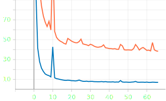
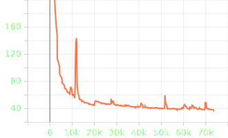
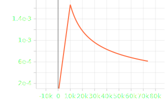
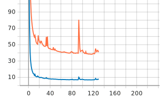
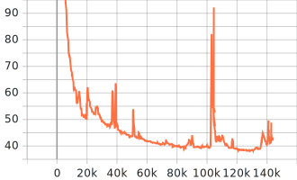
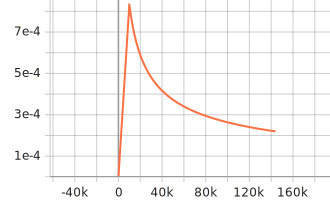

**Table of Contents**
- [SentencePiece 1k + Small + LibriSpeech](#sentencepiece-1k--small--librispeech)
    - [Training Loss](#training-loss)
      - [1. Epoch Loss](#1-epoch-loss)
      - [2. Batch Loss](#2-batch-loss)
    - [Training Learning Rate](#training-learning-rate)
    - [Results](#results)
- [SentencePiece 1k + Small + LibriSpeech + Without Weight Decay](#sentencepiece-1k--small--librispeech--without-weight-decay)
    - [Training Loss](#training-loss-1)
      - [1. Epoch Loss](#1-epoch-loss-1)
      - [2. Batch Loss](#2-batch-loss-1)
    - [Training Learning Rate](#training-learning-rate-1)
    - [Results](#results-1)


# SentencePiece 1k + Small + LibriSpeech


| Category          | Description                        |
| :---------------- | :--------------------------------- |
| Config            | [small.yml.j2](../../small.yml.j2) |
| Tensorflow        | **2.13.x**                         |
| Device            | Google Colab TPUs                  |
| Global Batch Size | 2 * 16 * 8 = 256 (as 8 TPUs)       |
| Max Epochs        | 300                                |


### Training Loss

#### 1. Epoch Loss



#### 2. Batch Loss



### Training Learning Rate




### Results

Pretrain Model here: [link](https://drive.google.com/drive/folders/1Kv_l4NxvtBSXFYLn459n5KysuQgf1vcZ?usp=drive_link)

```json
[
  {
    "epoch": 67,
    "test-clean": {
      "greedy": {
        "wer": 0.06362218502738892,
        "cer": 0.024043618797286257,
        "mer": 0.06317399762035165,
        "wil": 0.11067193097595462,
        "wip": 0.8893280690240454
      }
    },
    "test-other": {
      "greedy": {
        "wer": 0.15365951512141068,
        "cer": 0.07302077299290946,
        "mer": 0.1511444356748224,
        "wil": 0.25542074621900557,
        "wip": 0.7445792537809944
      }
    }
  },
]
```

# SentencePiece 1k + Small + LibriSpeech + Without Weight Decay


| Category          | Description                                          |
| :---------------- | :--------------------------------------------------- |
| Config            | [small-no-decay.yml.j2](../../small-no-decay.yml.j2) |
| Tensorflow        | **2.13.x**                                           |
| Device            | Google Colab TPUs                                    |
| Global Batch Size | 2 * 16 * 8 = 256 (as 8 TPUs)                         |
| Max Epochs        | 300                                                  |


### Training Loss

#### 1. Epoch Loss



#### 2. Batch Loss



### Training Learning Rate




### Results

Pretrain Model here: [link](https://drive.google.com/drive/folders/1MU7aB0SZfXIp4eRmGPH37h3TsWB8hqOy?usp=drive_link)

```json
[
  {
    "epoch": 115,
    "test-clean": {
      "greedy": {
        "wer": 0.06327982349360925,
        "cer": 0.02412176322239193,
        "mer": 0.06283642132698737,
        "wil": 0.110402410864341,
        "wip": 0.889597589135659
      }
    },
    "test-other": {
      "greedy": {
        "wer": 0.15083201192136483,
        "cer": 0.07265414763270005,
        "mer": 0.14853347882527798,
        "wil": 0.25123406103539114,
        "wip": 0.7487659389646089
      }
    }
  },
]
```