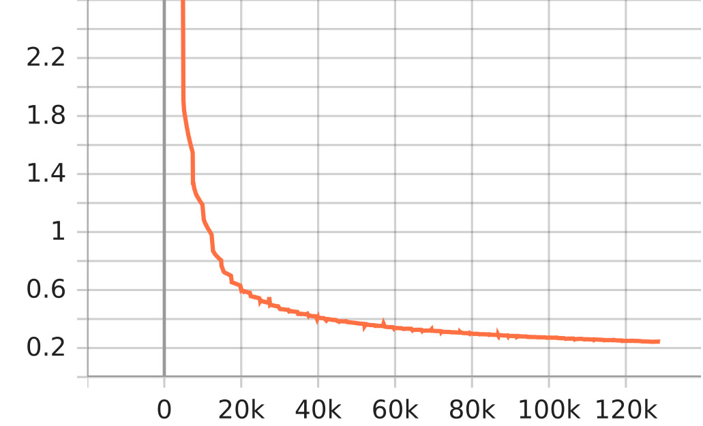

- [\[English\] LibriSpeech](#english-librispeech)
  - [I. Small + SentencePiece 1k](#i-small--sentencepiece-1k)
  - [II. Small + Streaming + SentencePiece 1k](#ii-small--streaming--sentencepiece-1k)
- [\[Vietnamese\] VietBud500](#vietnamese-vietbud500)
  - [I. Small + Streaming + SentencePiece 1k](#i-small--streaming--sentencepiece-1k)

<!-- ----------------------------------------------------- EN ------------------------------------------------------ -->

# [English] LibriSpeech

## I. Small + SentencePiece 1k

| Category          | Description                                                |
| :---------------- | :--------------------------------------------------------- |
| Config            | [small.yml.j2](../../small.yml.j2)                         |
| Tensorflow        | **2.18.0**                                                 |
| Device            | Google Cloud TPUs v4-8                                     |
| Mixed Precision   | strict                                                     |
| Global Batch Size | 4 * 4 * 8 = 128 (as 4 TPUs, 8 Gradient Accumulation Steps) |
| Max Epochs        | 300                                                        |

**Config:**

```jinja2

{{decoder_config}}

{{config}}
```

**Results:**

| Epoch | Dataset    | decoding | wer      | cer      | mer      | wil      | wip      |
| :---- | :--------- | :------- | :------- | :------- | :------- | :------- | :------- |
| 157   | test-clean | greedy   | 0.062918 | 0.025361 | 0.062527 | 0.109992 | 0.890007 |
| 157   | test-other | greedy   | 0.142616 | 0.066839 | 0.140610 | 0.239201 | 0.760798 |

## II. Small + Streaming + SentencePiece 1k

| Category          | Description                                                |
| :---------------- | :--------------------------------------------------------- |
| Config            | [small-streaming.yml.j2](../../small-streaming.yml.j2)     |
| Tensorflow        | **2.18.0**                                                 |
| Device            | Google Cloud TPUs v4-8                                     |
| Mixed Precision   | strict                                                     |
| Global Batch Size | 4 * 4 * 8 = 128 (as 4 TPUs, 8 Gradient Accumulation Steps) |
| Max Epochs        | 300                                                        |

**Config:**

```jinja2

{{decoder_config}}

{{config}}
```

**Results:**

| Epoch | Dataset    | decoding | wer      | cer       | mer      | wil      | wip      |
| :---- | :--------- | :------- | :------- | :-------- | :------- | :------- | :------- |
| 45    | test-clean | greedy   | 0.110564 | 0.0460022 | 0.109064 | 0.186109 | 0.813891 |
| 45    | test-other | greedy   | 0.267772 | 0.139369  | 0.260952 | 0.417361 | 0.582639 |

<!-- ----------------------------------------------------- VN ------------------------------------------------------ -->

# [Vietnamese] VietBud500

## I. Small + Streaming + SentencePiece 1k

| Category          | Description                                                |
| :---------------- | :--------------------------------------------------------- |
| Config            | [small-streaming.yml.j2](../../small-streaming.yml.j2)     |
| Tensorflow        | **2.18.0**                                                 |
| Device            | Google Cloud TPUs v4-8                                     |
| Mixed Precision   | strict                                                     |
| Global Batch Size | 8 * 4 * 8 = 256 (as 4 TPUs, 8 Gradient Accumulation Steps) |
| Max Epochs        | 300                                                        |

**Config:**

```jinja2

{{decoder_config}}

{{config}}
```

**Tensorboard:**

<table>
  <tr>
    <td align="center">
      <br>
      <sub><strong>Epoch Loss</strong></sub>
    </td>
    <td align="center">
      <br>
      <sub><strong>Batch Loss</strong></sub>
    </td>
    <td align="center">
      <br>
      <sub><strong>Learning Rate</strong></sub>
    </td>
  </tr>
</table>

**Results:**

| Epoch | decoding | wer      | cer      | mer     | wil      | wip      |
| :---- | :------- | :------- | :------- | :------ | :------- | :------- |
| 52    | greedy   | 0.053723 | 0.034548 | 0.05362 | 0.086421 | 0.913579 |

**Pretrained Model**: [Link](https://www.kaggle.com/models/lordh9072/tfasr-vietbud500-conformer-transducer/tensorFlow2/small-streaming)