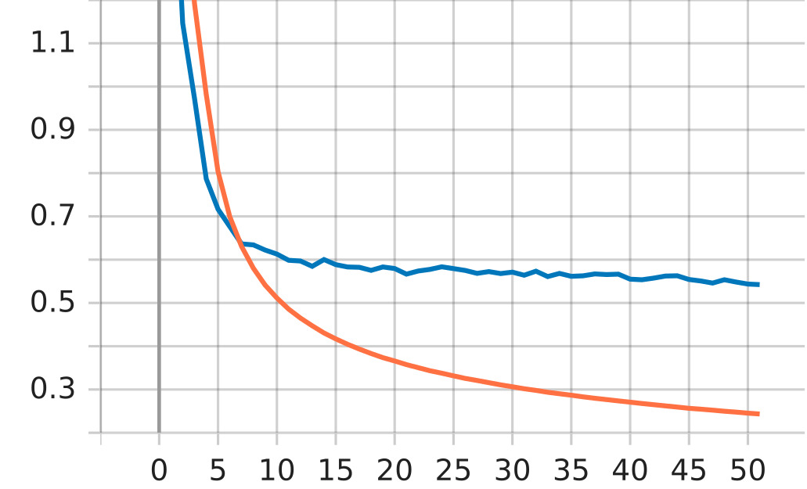
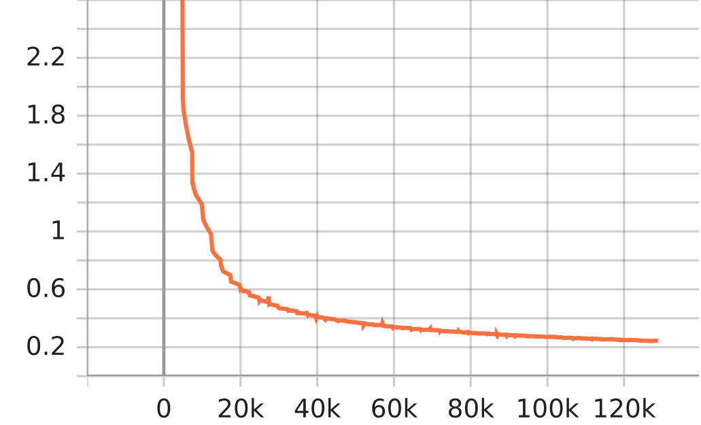

- [\[English\] LibriSpeech](#english-librispeech)
  - [I. Small + SentencePiece 1k](#i-small--sentencepiece-1k)
  - [II. Small + Streaming + SentencePiece 1k](#ii-small--streaming--sentencepiece-1k)
- [\[Vietnamese\] VietBud500](#vietnamese-vietbud500)
  - [I. Small + Streaming + SentencePiece 1k](#i-small--streaming--sentencepiece-1k)

<!-- ----------------------------------------------------- EN ------------------------------------------------------ -->

# [English] LibriSpeech

## I. Small + SentencePiece 1k

| Category          | Description                                                                                     |
| :---------------- | :---------------------------------------------------------------------------------------------- |
| Config            | [small.yml.j2](../../small.yml.j2)                                                              |
| Tensorflow        | **2.18.0**                                                                                      |
| Device            | Google Cloud TPUs v4-8                                                                          |
| Mixed Precision   | strict                                                                                          |
| Global Batch Size | 4 * 4 * 8 = 128 (as 4 TPUs, 8 Gradient Accumulation Steps)                                      |
| Max Epochs        | 300                                                                                             |
| Pretrained        | [Link](https://www.kaggle.com/models/lordh9072/tfasr-conformer-transducer/tensorFlow2/v3-small) |

**Config:**

```jinja2

{{decoder_config}}

{{config}}
```

**Results:**

| Epoch | Dataset    | decoding | wer      | cer      | mer      | wil      | wip      |
| :---- | :--------- | :------- | :------- | :------- | :------- | :------- | :------- |
| 157   | test-clean | greedy   | 0.062918 | 0.025361 | 0.062527 | 0.109992 | 0.890007 |
| 157   | test-other | greedy   | 0.142616 | 0.066839 | 0.140610 | 0.239201 | 0.760798 |

## II. Small + Streaming + SentencePiece 1k

| Category          | Description                                                                                               |
| :---------------- | :-------------------------------------------------------------------------------------------------------- |
| Config            | [small-streaming.yml.j2](../../small-streaming.yml.j2)                                                    |
| Tensorflow        | **2.18.0**                                                                                                |
| Device            | Google Cloud TPUs v4-8                                                                                    |
| Mixed Precision   | strict                                                                                                    |
| Global Batch Size | 4 * 4 * 8 = 128 (as 4 TPUs, 8 Gradient Accumulation Steps)                                                |
| Max Epochs        | 300                                                                                                       |
| Pretrained        | [Link](https://www.kaggle.com/models/lordh9072/tfasr-conformer-transducer/tensorFlow2/v3-small-streaming) |

**Config:**

```jinja2

{{decoder_config}}

{{config}}
```

**Results:**

| Epoch | Dataset    | decoding          | wer           | cer           | mer       | wil      | wip      |
| :---- | :--------- | :---------------- | :------------ | :------------ | :-------- | :------- | :------- |
| 45    | test-clean | greedy            | 0.0797322     | 0.0312862     | 0.0790049 | 0.137228 | 0.862772 |
| 45    | test-clean | beam              | 0.0771264     | 0.0299684     | 0.0764229 | 0.133026 | 0.866974 |
| 45    | test-clean | beam_lm (shallow) | 0.0733224     | 0.0300607     | 0.072629  | 0.126191 | 0.873809 |
| 45    | test-clean | beam_lm (lodr)    | **0.0706977** | **0.0284588** | 0.0700792 | 0.122154 | 0.877846 |
| 45    | test-other | greedy            | 0.211872      | 0.104173      | 0.207305  | 0.341269 | 0.658731 |
| 45    | test-other | beam              | 0.200753      | 0.0972657     | 0.196419  | 0.325882 | 0.674118 |
| 45    | test-other | beam_lm (shallow) | 0.189061      | 0.0967084     | 0.185097  | 0.306269 | 0.693731 |
| 45    | test-other | beam_lm (lodr)    | **0.183425**  | **0.0927416** | 0.179801  | 0.29952  | 0.70048  |

<!-- ----------------------------------------------------- VN ------------------------------------------------------ -->

# [Vietnamese] VietBud500

## I. Small + Streaming + SentencePiece 1k

| Category          | Description                                                                                                       |
| :---------------- | :---------------------------------------------------------------------------------------------------------------- |
| Config            | [small-streaming.yml.j2](../../small-streaming.yml.j2)                                                            |
| Tensorflow        | **2.18.0**                                                                                                        |
| Device            | Google Cloud TPUs v4-8                                                                                            |
| Mixed Precision   | strict                                                                                                            |
| Global Batch Size | 8 * 4 * 8 = 256 (as 4 TPUs, 8 Gradient Accumulation Steps)                                                        |
| Max Epochs        | 300                                                                                                               |
| Pretrained        | [Link](https://www.kaggle.com/models/lordh9072/tfasr-vietbud500-conformer-transducer/tensorFlow2/small-streaming) |

**Config:**

```jinja2

{{decoder_config}}

{{config}}
```

**Tensorboard:**

<table>
  <tr>
    <td align="center">
      <br>
      <sub><strong>Epoch Loss</strong></sub>
    </td>
    <td align="center">
      <br>
      <sub><strong>Batch Loss</strong></sub>
    </td>
    <td align="center">
      <br>
      <sub><strong>Learning Rate</strong></sub>
    </td>
  </tr>
</table>

**Results:**

| Epoch | decoding | wer      | cer      | mer     | wil      | wip      |
| :---- | :------- | :------- | :------- | :------ | :------- | :------- |
| 52    | greedy   | 0.053723 | 0.034548 | 0.05362 | 0.086421 | 0.913579 |