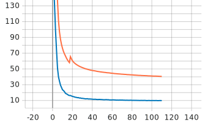
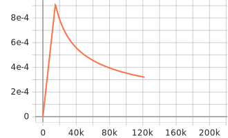

**Table of Contents**
- [SentencePiece 1k + Small + LibriSpeech](#sentencepiece-1k--small--librispeech)
    - [Training Loss](#training-loss)
    - [Training Learning Rate](#training-learning-rate)
    - [Results](#results)


# SentencePiece 1k + Small + LibriSpeech


| Category      | Description                        |
| :------------ | :--------------------------------- |
| Config        | [small.yml.j2](../../small.yml.j2) |
| Tensorflow    | **2.13.x**                         |
| Device        | Google Colab TPUs                  |
| Training time | Around 3670s per epoch             |


### Training Loss



### Training Learning Rate




### Results

Pretrain Model here: [link]()

```json
[
  {
    "epoch": 111,
    "test-clean": {
      "greedy": {
        "wer": 0.09327449786975045,
        "cer": 0.0397613043014954,
        "mer": 0.09214407846526747,
        "wil": 0.159081740313036,
        "wip": 0.840918259686964
      }
    },
    "test-other": {
      "greedy": {
        "wer": 0.22002942131708156,
        "cer": 0.11382617558421751,
        "mer": 0.2142299107142857,
        "wil": 0.350766969103941,
        "wip": 0.649233030896059
      }
    }
  }
]
```
