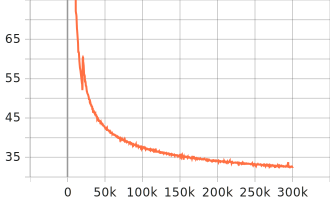

**Table of Contents**
- [WordPiece 1k With Whitespace + Small + LibriSpeech](#wordpiece-1k-with-whitespace--small--librispeech)
    - [Epoch Loss](#epoch-loss)
    - [Batch Loss](#batch-loss)
    - [Training Learning Rate](#training-learning-rate)
    - [Results](#results)

# WordPiece 1k With Whitespace + Small + LibriSpeech


| Category          | Description                        |
| :---------------- | :--------------------------------- |
| Config            | [small.yml.j2](../../small.yml.j2) |
| Tensorflow        | **2.13.x**                         |
| Device            | Google Colab TPUs                  |
| Global Batch Size | 2 * 16 * 8 = 256 (as 8 TPUs)       |


### Epoch Loss


### Batch Loss



### Training Learning Rate


### Results

Pretrain Model here: [link](https://drive.google.com/drive/folders/1xT3j_L5q4oSBeUiLArnBPliZ0g9k-N7O?usp=drive_link)

```json
[
  {
    "epoch": 273,
    "test-clean": {
      "greedy": {
        "wer": 0.07923767498478393,
        "cer": 0.0336269669307001,
        "mer": 0.07840111410128536,
        "wil": 0.13531145375649656,
        "wip": 0.8646885462435034
      }
    },
    "test-other": {
      "greedy": {
        "wer": 0.19121945627877654,
        "cer": 0.09776798480704507,
        "mer": 0.1870526453493805,
        "wil": 0.3107931720744128,
        "wip": 0.6892068279255872
      }
    }
  }
]
```