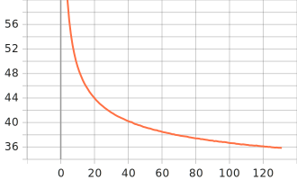
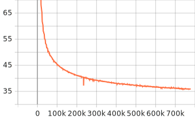

- [SentencePiece 256 + Tiny + LibriSpeech](#sentencepiece-256--tiny--librispeech)
    - [Training Loss](#training-loss)
      - [1. Epoch Loss](#1-epoch-loss)
      - [2. Batch Loss](#2-batch-loss)
    - [Results](#results)


# SentencePiece 256 + Tiny + LibriSpeech

| Category          | Description                      |
| :---------------- | :------------------------------- |
| Config            | [tiny.yml.j2](../../tiny.yml.j2) |
| Tensorflow        | **2.15.x**                       |
| Device            | NVIDIA GeForce GTX 1650          |
| Global Batch Size | 3                                |
| Max Epochs        | 300                              |


### Training Loss

#### 1. Epoch Loss



#### 2. Batch Loss




### Results

Pretrain Model here: [link](https://drive.google.com/drive/folders/1h0BrCzZo8JTz_MUU5bJPJ3UBqroBnsuv?usp=sharing)

```json
[
  {
    "epoch": 136,
    "test-clean": {
      "greedy": {
        "wer": 0.15853241022519782,
        "cer": 0.07179696657549817,
        "mer": 0.15537908021549876,
        "wil": 0.2587056704145151,
        "wip": 0.7412943295854849
      }
    },
    "test-other": {
      "greedy": {
        "wer": 0.3457577899623636,
        "cer": 0.18733822655980759,
        "mer": 0.33391759995571874,
        "wil": 0.5185365485613327,
        "wip": 0.48146345143866726
      }
    }
  },
]