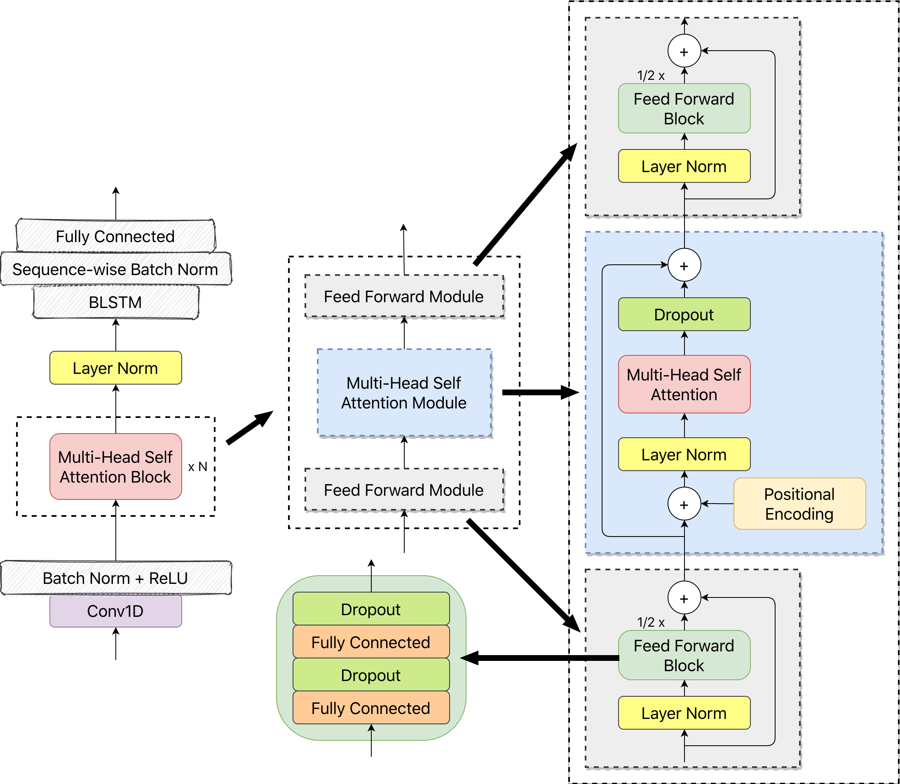

# Custom Self Attention Deep Speech 2

My customized model based on Deep Speech 2 by adding Multihead Self Attention layers (With Additional Residual) between each Convolution and Batch Norm



## Model YAML Config Structure

```yaml
model_config:
  subsampling:
    filters: 144
    kernel_size: 32
    strides: 2
  att:
    layers: 16
    head_size: 36
    num_heads: 4
    ffn_size: 1024
    dropout: 0.1
  rnn:
    layers: 1
    units: 320
    dropout: 0
```

## Training and Testing

See `python examples/self_attention_ds2/run_sattds2.py --help`

## Results on Vivos

* Features: Log Mel Spectrogram with `80` frequency channels
* KenLM: `alpha = 2.0` and `beta = 1.0`
* Epochs: `20`
* Train set split ratio: `90:10`
* Augmentation: `None`
* Model architecture: same as above YAML

**CTC Loss**


**Error rates**

|                 |    WER (%)     |    CER (%)     |
| :-------------- | :------------: | :------------: |
| *BeamSearch*    |      45.09     |     17.775     |
| *BeamSearch LM* |    **19.36**   |    **9.94**    |
