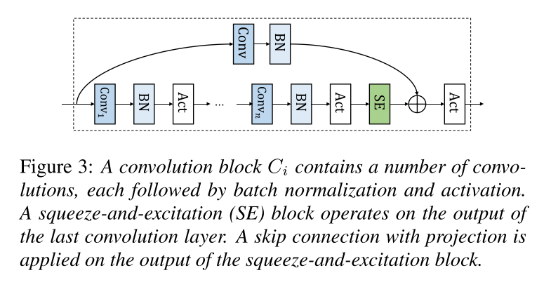
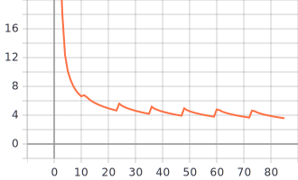
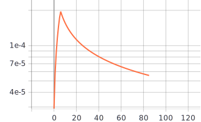

# ContextNet: Improving Convolutional Neural Networks for Automatic Speech Recognition with Global Context

Reference: [http://arxiv.org/abs/2005.03191](http://arxiv.org/abs/2005.03191)

## Example Model YAML Config

Go to [config.yml](./config.yml)

## Usage

Training, see `python examples/contextnet/train.py --help`

Testing, see `python examples/contextnet/test.py --help`

TFLite Conversion, see `python examples/contextnet/inference/gen_tflite_model.py --help`

## WordPiece ContextNet - Results on LibriSpeech

| **Name**                  | **Description**                                      |
| :------------------------ | :--------------------------------------------------- |
| Number of tokens          | 1000                                                 |
| Maximum length of a token | 50                                                   |
| WordPiece corpus          | all training transcripts.tsv                         |
| Train on                  | 8 Google Colab TPUs                                  |
| Train hours               | 8.375 days uncontinuous (3.58333333 days continuous) |

**Pretrained and Config**, go to [drive](https://drive.google.com/drive/folders/1fzOkwKaOcMUMD9BAjcLLmSG2Tfpeabbq?usp=sharing)

**Epoch RNNT Loss**

**Epoch Learning Rate**

**Error Rates**

| **Test-clean** | Test batch size | Epoch | WER (%) | CER (%) |
| :------------: | :-------------: | :---: | :-----: | :-----: |
|    _Greedy_    |        1        |  86   |         |         |

| **Test-other** | Test batch size | Epoch | WER (%) | CER (%) |
| :------------: | :-------------: | :---: | :-----: | :-----: |
|    _Greedy_    |        1        |  86   |         |         |