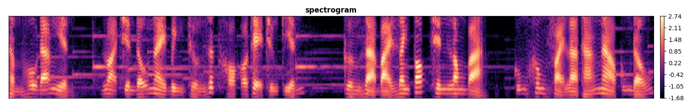
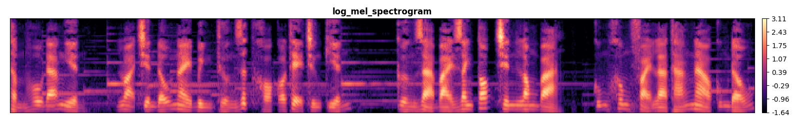
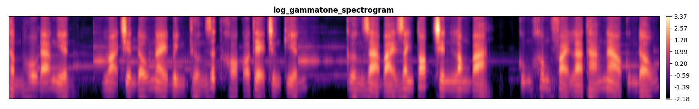

# Features Extraction

## Speech Features

**Speech features** are extracted from the **Signal** with `sample_rate`, `frame_ms`, `stride_ms` and `num_feature_bins`.

Speech features has the shape `(B, T, num_feature_bins, num_channels)` and it contains from 1-4 channels:

1. Spectrogram, Log Mel Spectrogram, Log Gammatone Spectrogram or MFCCs
2. Delta features: `librosa.feature.delta` from the features extracted on channel 1.
3. Delta deltas features: `librosa.feature.delta` with `order=2` from the features extracted on channel 1.
4. Pitch features: `librosa.core.piptrack` from the signal

There are 2 classes for Speech Features Extraction: `SpeechFeaturizer` (uses `librosa`) and `TFSpeechFeaturizer` (uses `tf.signal`). The tf based class does not support `delta, delta_delta, pitch` features yet.

_Note_: `TFSpeechFeaturizer` class **should be used** if you want to deploy `tflite`.








## Text Features

**Text features** are read as index from the file like the default `tensorflow_asr.featurizers.english.txt` plus 1 for the blank index.

The **blank** index is either `0` or `num_classes - 1` where `num_classes` is number of characters in your language (exclude blank).

Class `TextFeaturizer` is initialized with the `decoder_config` as follows:

```yaml
decoder_config:
    vocabulary: path_to_vocab_txt
    blank_at_zero: bool
    beam_width: int,
    lm_config: ...
```

## TODO

-   Implement `TFSpeechFeaturizer` to extract `delta, delta_delta, pitch` features
